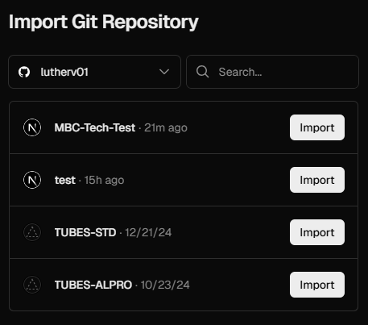
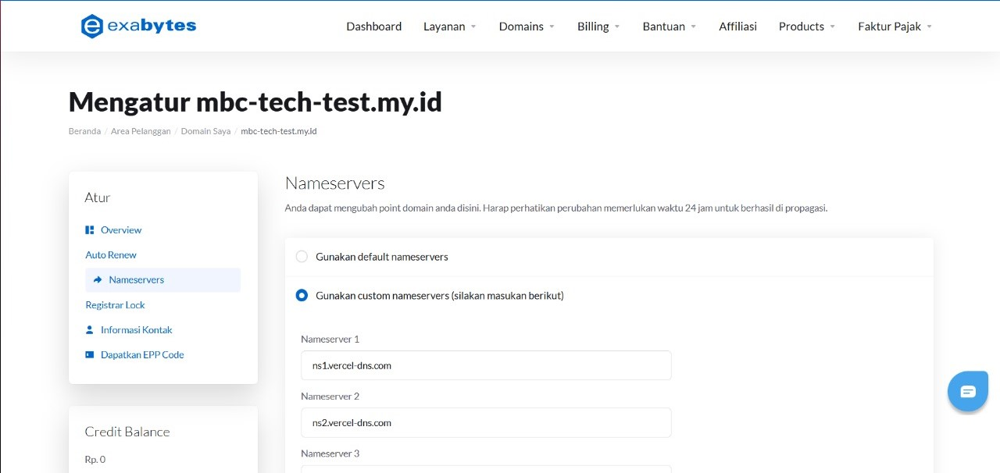
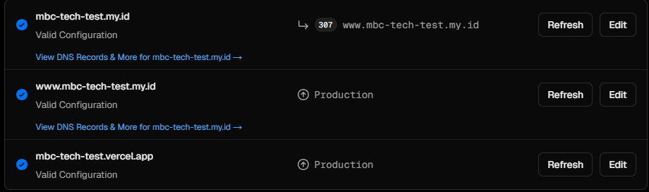
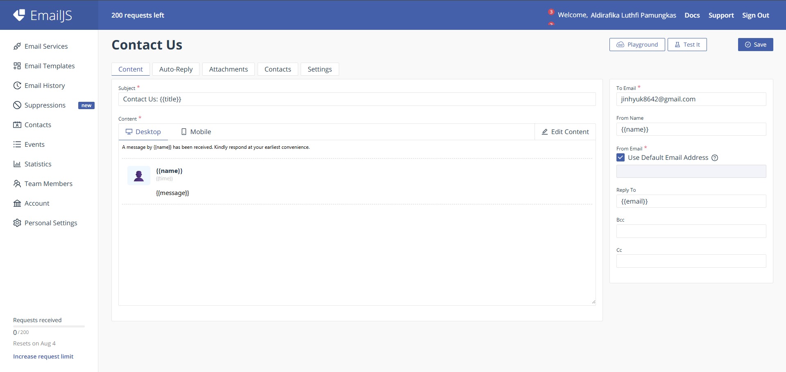
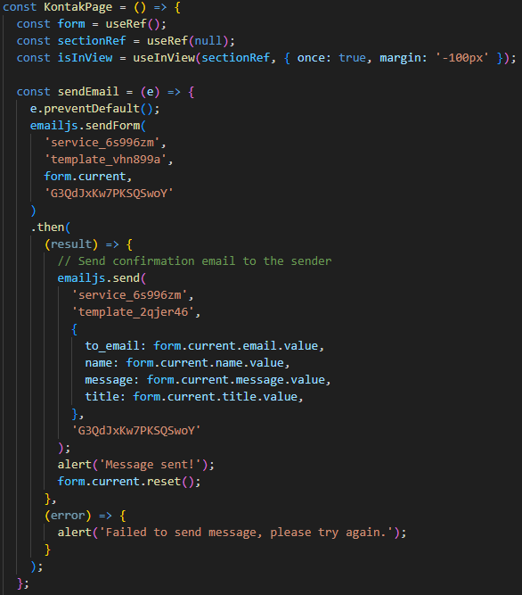

#MBC Laboratory Landing Page

Pembuatan landing page MBC Laboratory yang menampilkan informasi aktual dan terkini mengenai MBC Laboratory dan dibuat dengan NextJS dan EmailJS yang mana pengunjung dapat meninggalkan pesan yang akan terkirim secara otomatis melalui email.

Site dapat dikunjungi di [ http://www.mbc-tech-test.my.id ]

## Struktur Proyek

```
mbc/
├── eslint.config.mjs
├── jsconfig.json
├── next.config.mjs
├── package-lock.json
├── package.json
├── postcss.config.mjs
├── public/ #THIS CONTAINS ASSET (IMAGE)
├── README.md
└── src/
    ├── app/
    │   ├── divisi/
    │   │   └── page.jsx #Halaman Divisi
    │   ├── kontak/
    │   │   └── page.jsx #Halaman Kontak
    │   |── tentang/
    │   |   └── page.jsx #Halaman Tentang atau Developer
    │   ├── favicon.ico
    │   ├── globals.css
    │   ├── layout.js
    │   └── page.jsx #Halaman Utama
    └── components/ #Komponen UI Seperti Header, Footer, dan lain sebagainya
        ├── About.jsx
        ├── Footer.jsx
        ├── Header.jsx
        ├── Hero.jsx
        └── VisionMission.jsx
```

## Instalasi

1. **Clone repository:**
   ```bash
   git clone <your-repo-url>
   cd mbc
   ```
2. **Install framework:**
   ```bash
   npm install
   ```
3. **Jalankan proyek secara lokal:**
   ```bash
   npm run dev
   ```

## Deployment

Proyek ini menggunakan vercel sebagai developer.

1. Proyek disimpan pada repository github.
2. Buka vercel dan kaitkan dengan akun github.
3. Import dengan repository yang sesuai.
<div align="center">
  <p>
      
  </p>
</div>

Selain itu, proyek ini menggunakan custom domain.

1. Buka 'Project Settings'.
2. Buka 'Domains'.
3. Setelah itu 'Add Domain'.
4. Sesuaikan CNAME dan A, kemudian tunggu beberapa saat.
<div align="center">
  <p>
      
  </p>
</div>

## SSL Configuration

Konfigurasi SSL dapat dilihat pada 'Project' -> 'Project Settings' -> Domain. Pada menu tersebut, setiap domain memiliki status SSL masing-masing. Dan pada proyek ini terdapat 3 domain, yaitu.

1. mbc-tech-test.my.id
2. www.mbc-tech-test.my.id
3. mbc-tech-test.vercel.app
<div align="center">
  <p>
      
  </p>
</div>

## Backend

Pada proyek ini, konfigurasi backend tidak dilakukan. EmailJS langsung secara otomatis mengirimkan pesan pengunjung dan adapun untuk konfigurasi EmailJS sebagai berikut.

1. Import EmailJS
2. Buat template email pada EmailJS
<div align="center">
  <p>
      
  </p>
</div>

<div align="center">
  <p>
      
  </p>
</div>
---
